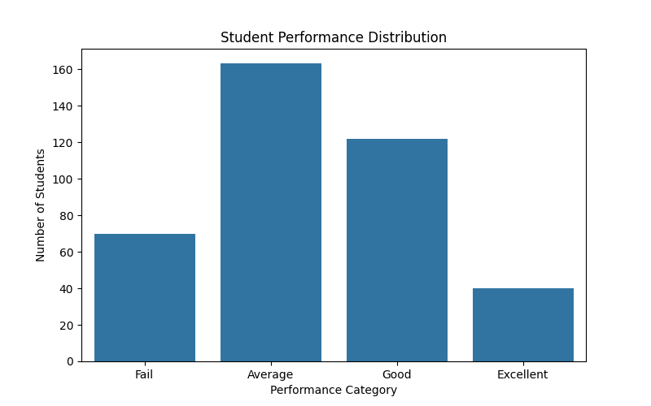
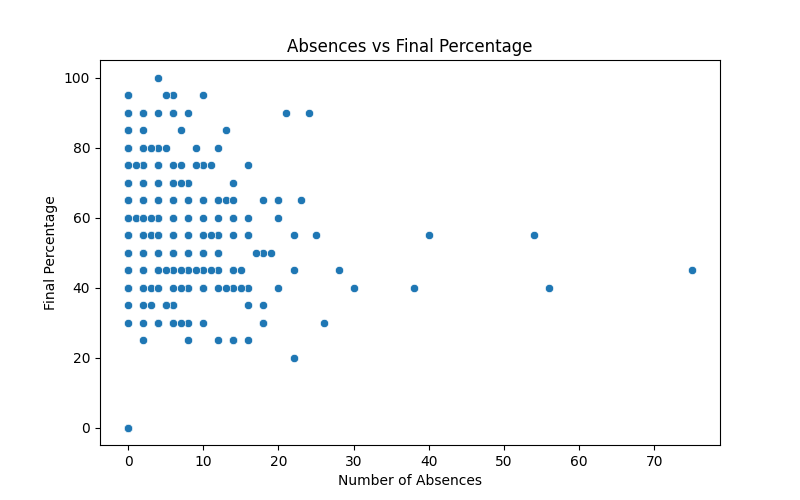
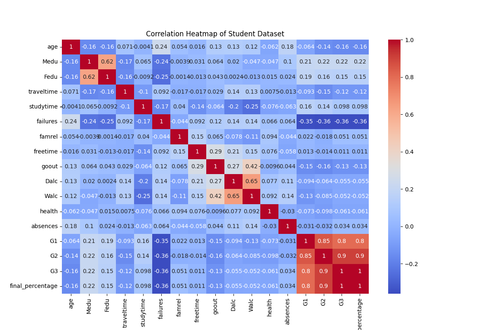

# 📊 Student Performance Analysis Dashboard

## 🔗 Live Dashboard

**Open here:** https://student-performance-analysis-nedbcqwtmwoy9scyx56cc4.streamlit.app/

---

## Project Overview

This project analyzes student academic performance data to identify factors that influence final grades.
The goal is to transform raw data into actionable insights and help identify students at risk of poor performance.

The analysis includes data cleaning, feature engineering, exploratory data analysis (EDA), and correlation analysis, followed by an interactive dashboard for visualization.

---

## Objectives

* Understand distribution of student performance
* Identify factors affecting grades
* Analyze effect of study time and attendance
* Detect students at risk of failing
* Provide recommendations for academic intervention

---
##  Tech Stack

* Python
* Pandas & NumPy
* Matplotlib & Seaborn
* Streamlit
* Jupyter Notebook

---

## Key Insights

* Students with higher study time show better academic performance
* Higher absences are associated with lower final grades
* Previous failures strongly predict future performance
* Attendance and consistency play a critical role in student success

---

## Visualizations

### Performance Distribution



### Study Time vs Performance


### Absences vs Performance



### Correlation Heatmap



---

##  Dataset

Student Performance Dataset — UCI Machine Learning Repository

---

## ▶️ How to Run Locally

```bash
git clone https://github.com/manak-sharma20/student-performance-analysis.git
cd student-performance-analysis
pip install -r requirements.txt
streamlit run dashboard/dashboard.py
```

---

## 📌 Conclusion

The project demonstrates an end-to-end data analysis workflow: data preparation, analysis, visualization, and communication of insights through a live dashboard.
It shows how data can be used to identify at-risk students early and support data-driven decision making in education.
